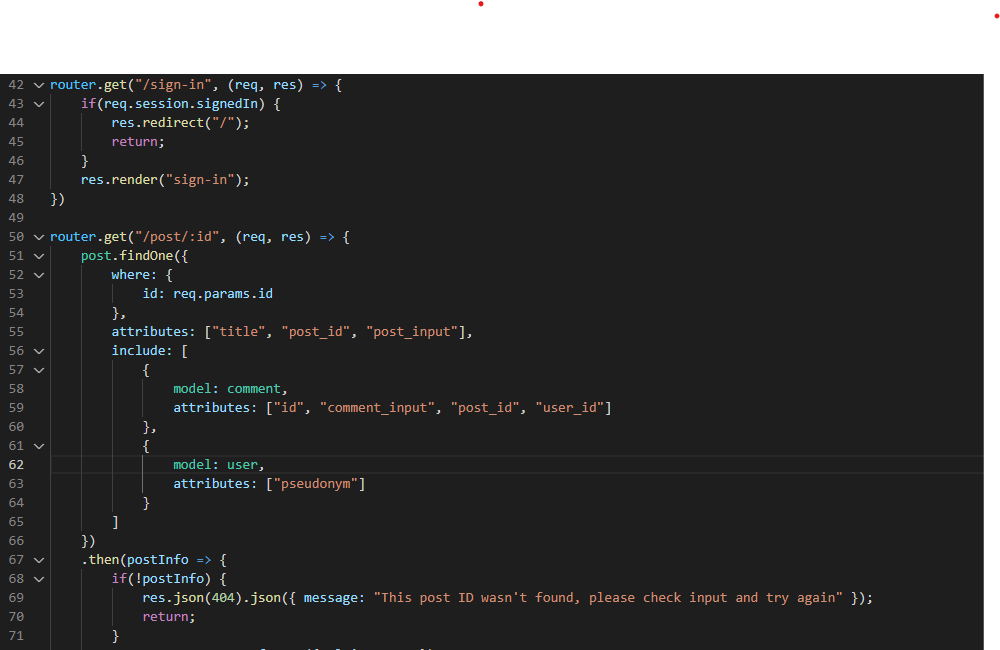

# In The Know Tech Blog
  
## Description
In The Know Tech Blog is projected to be the next big user-source information page in the tech community. There are a few thing yet to be done with this application but it currently contains most of the necessary code for the application to run. However, there are some issues with the routing and ports that prevent a lot of capability as well as online deployment.

## User Story
* AS A developer who writes about tech

* I WANT a CMS-style blog site

* SO THAT I can publish articles, blog posts, and my thoughts and opinions

## Table of Contents
- [Built With](#languages)
- [Source Code Screenshot](#Code)
- [Installation](#Install)
- [Usage](#Usage)
- [Contribution](#contributing)
- [Questions](#questions)

## Built With
* JavaScript
* Handlebars

## Source Code Screenshot

## Installation

### Personal Workstation Use:
To use this and test this product on your own machine, you must first clone to repository to your local drive. Next, run NPM Init and and install the following packages.

* MySQL2
* Sequelize
* Express.js
* dotenv
* bcrypt
* express-session
* connect-session-sequelize
* Handlebars.js
* express-handlbars

## Usage
Once Node and the appropriate packages are installed, create a .env file in the root directory following this format:

DB_NAME=in_the_know
DB_USER=<your_mysql_username>
DB_PW=<your_mysql_password>

Next, open the mysql shell to create the database. Run mysql -u root -p in the terminal and foloowing the password prompt. Now, you must run source db/schema.sql to create the database and relevant tables. You can now run quit to exit the shell. At last, runnpm start to initialize the application. You can now navigate to http://localhost:3001 in your browser to run the application in its current state as well as test it for debugging and other fixes that are necessary.

This application is deployed to Heroku [Here](https://afternoon-brook-48793.herokuapp.com/) : However, due to either routing or port issue, it does not work.

## Contribution
- This project was made by Evan Carlson and contains references and material learned in the University of Minnesota Web Dev Bootcamp.
- Also referenced was my group and I's submission for Project 2 in the University of Minnesota Web Dev Bootcamp, a link to this repository can be found [Here](https://github.com/mukey6/Park-Rating)

Since this app is not fully functional, contribution ARE being accepted at this time. Please refer to section below for contact information.

## Questions
If you have any questions on this application, feel free to reach me through my GitHub profile [epc318](https://github.com/epc318) or [E-mail](carl4917@umn.edu):

### ©️2022  Profession Pointers, Inc.